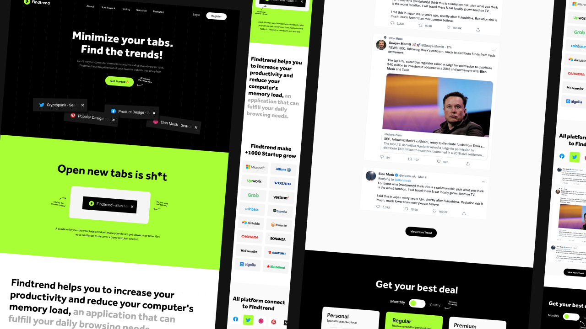

<!-- PROJECT LOGO -->

  

<h3 align="center">Findtrend</h3>

  

    A static | dummy website for finding the latest and popular posts from social media platform.

## <a href="https://staticfindtrend.netlify.app/">Live Demo 🚀</a>

### Objective
The main objective of the project is to CSS BEM architecture and mobile-first responsive design.

## >___ tools./

- 
- 
- 
- 
- 

### Thanks odamastudio for the design & resources

<a href="https://www.figma.com/community/file/1089887786555738954">View design on figma</a>